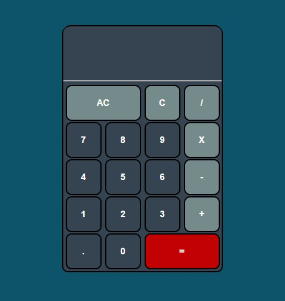

<h1 align="center">Calculadora</h1>

Calculadora feita com HTML, CSS e JavaScript  

 <a href="#-tecnologias">Tecnologias</a>&nbsp;&nbsp;&nbsp|&nbsp;&nbsp;&nbsp;
 <a href="#-Layout">Layout</a>
 

 

## 🚀 Tecnologias

Esse projeto foi desenvolvido com as seguintes tecnologias:

- HTML e CSS
- JavaScript

## 📋 Layout
- [Visite o projeto online](rianxavier.github.io/CalculadoraJS/)

  

